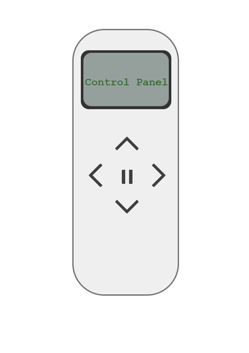

# Control Panel Interface
Interface designed to control the robot movement directions.

# Usage
After running the program this web page will appear

the function of this interface is to control the robot movement by clicking on the arrows that describes the direction that the robot must head for.
